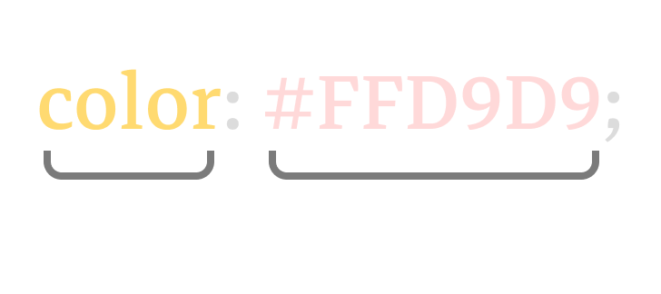

# CSS 介紹和基本用法

CSS 的作用就是改變網頁元素的外觀，例如文字大小、顏色、邊框、粗幼度和字體類型，以及最重要的元素佈局。這裡會提及到如何使用 CSS，和正確的使用方式。

> 其中一個對我來說很重要的功能就是增加互動性，例如當游標懸掛在元素時，可以修改其元素的外觀，而游標離開後則回到原本的外觀狀態。

## CSS 聲明 - Declaration

我們可以通過一對屬性與值來去修改元素的樣式。中間會使用冒號 `:` 隔開屬性和值，最後會使用一個分號 `;` 來示意你的 CSS 聲明已經完結。



## 最直接的使用方法

還記得我們剛剛提過的元素屬性嗎？我們可以用屬性名稱 `style` 來去修改元素的樣式。例如我們想把指定的 `<p>` 元素的字體顏色改為紅色：

```html
...
    <p style="color: red">CPS Workshop</p>
...
```

又或者同時想把這句句子中的 CPS 改為藍色和粗體，我們可以用一個 `<span>` 元素去包著 CPS 然後單獨去做樣式修改：

```html
...
    <p style="color: red;"><span style="color: blue; font-weight: bold;">CPS</span> Workshop</p>
...
```

> 這樣的寫法稱為 `inline styles`，行內樣式。也就是直接在元素上利用屬性去修改 CSS。

## 常見的 CSS 屬性

這裡會提到部分常用的 CSS 屬性，主要是我日常當中很常用到的屬性。

### 字體相關的屬性

文字顏色：
```css
/* 預設的文字顏色是 black or #000000 */
color: red;
color: #FF0000;
color: rgb(255, 0, 0);
color: rgba(255, 0, 0, 1);
```

文字字體：
```css
font-family: 'Arial';
font-family: 'Arial', sans-serif;
font-family: monospace, cursive, Times New Roman;
```

> 你可以定義多於一個字體。從最左邊開始，當用戶的瀏覽器不支援此字體時就會往右邊一個字體看能不能用，如此類推。

文字大小
```css
font-size: 16px;
font-size: 1rem;
```

文字粗幼度
```css
/* 文字的粗幼度可以使用數字和文字來表達，數值的話是從 100 至 900，每一個都相隔100。 */
font-weight: normal; /* 和 font-weight: 400 一樣 */
font-weight: bold; /* 和 font-weight: 600 一樣 */
```