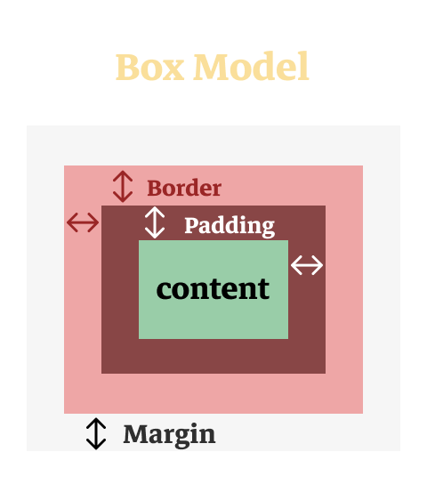
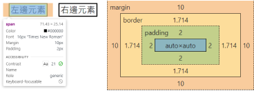

# CSS基礎佈局

在學習實用的佈局技巧之前，我們需要先學習預設的佈局是怎樣的。你有留意到不同的元素是如何排佈的嗎？是由上到下還是左到右？我們將會在這個章節教會你這個觀念！

## 元素的預設佈局

每一種元素都有一個特定的佈局模式，而這種預設的模式主要分了 `inline` 和 `block`。第一種分別是很直接容易理解的， `inline` 元素預設不會霸佔頁面上的一行，也就是說元素不會跑到新的一行裡。

```html
<p>CPS</p><p>This will be in the same line</p>
```

而 `block` 元素預設是會霸佔整行的位置，所以兩個相鄰的 `block` 元素預設是不會在同一行的。
```html
<div>CPS</div>
<div>This will be in the new line</div>
```


## 常見元素的預設佈局

以下的便是常見元素的佈局，除此之外還有很多元素。詳情可以在 [`htmlreference`](https://htmlreference.io/) 選取不同的標籤查看。

```css
display: inline;
/* vs */
display: block;
```


---

## 盒子模型 - Box Model

除了預設佈局外，還有一個非常重要的概念可以幫助我們改變元素的佈局。其實每一個元素在瀏覽器的眼中都是一個盒子，總共分了三層的盒子，最外層：Margin；第二層：Border；第三層：Padding；到最內一層才是我們元素實際內容的大小。



我們可以通過兩個 `<p>` 元素看看效果：

```html
<head>
    <style>
        span {
            border: solid 2px black;
            margin: 10px;
            padding: 2px;
        }
    </style>
</head>

<body>
    <span>左邊元素</span>
    <span>右邊元素</span>
</body>
```

我們可以滑鼠右鍵點擊檢查去打開開發者工具，在 Chrome 的開發者工具中，我們可以查看元素的盒子模型，開發者工具清晰地告訴我們元素盒子模型的數值。



> 在學習的路上，甚至是工作時，我們都會利用開發者工具去進行排查，看看那一個位置出現了問題。所以學習如何使用這個工具也是一個重要的事情。