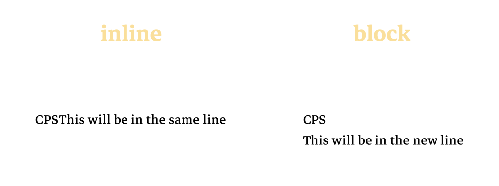
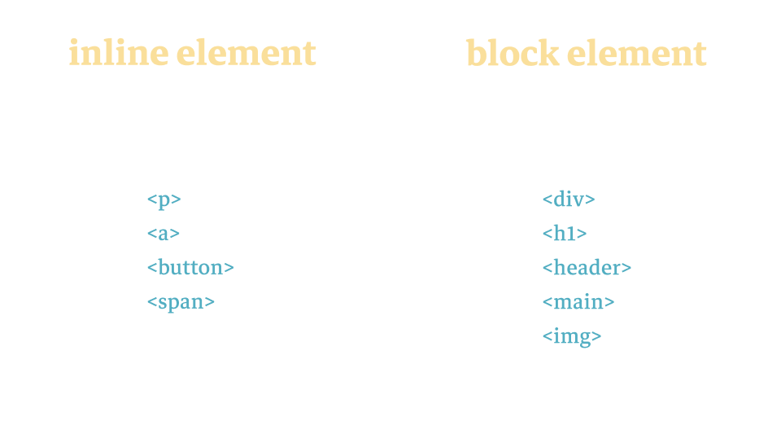

# CSS基礎佈局

在學習實用的佈局技巧之前，我們需要先學習預設的佈局是怎樣的。你有留意到不同的元素是如何排佈的嗎？是由上到下還是左到右？我們將會在這個章節教會你這個觀念！

## 元素的預設佈局

每一種元素都有一個特定的佈局模式，而這種預設的模式主要分了 `inline` 和 `block`。第一種分別是很直接容易理解的， `inline` 元素預設不會霸佔頁面上的一行，也就是說元素不會跑到新的一行裡。

```html
<p>CPS</p><p>This will be in the same line</p>
```

而 `block` 元素預設是會霸佔整行的位置，所以兩個相鄰的 `block` 元素預設是不會在同一行的。
```html
<div>CPS</div>
<div>This will be in the new line</div>
```



## 常見元素的預設佈局

以下的便是常見元素的佈局，除此之外還有很多元素。詳情可以在 [`htmlreference`](https://htmlreference.io/) 選取不同的標籤查看。

```css
display: inline;
/* vs */
display: block;
```



