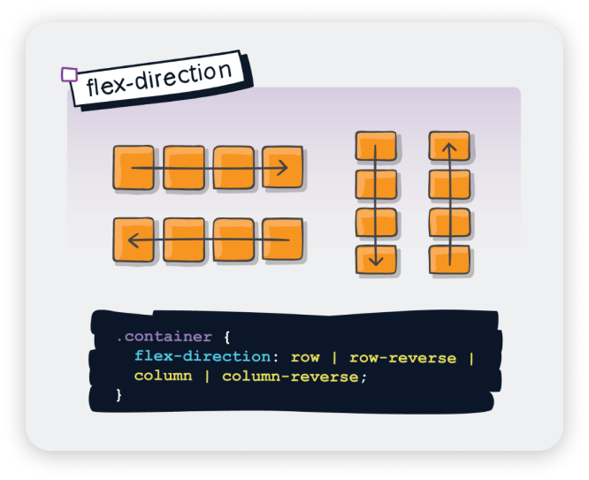

# CSS實用的佈局技巧

我們前面有提到過容器，但是都沒有更詳細的介紹它的用法。是時候學習容器的真正用處了！

## 容器的作用

容器是我們寫 CSS 時可以操縱多個元素佈局的重要基石。瀏覽器就是按照元素是 `inline` 或是 `block` 的預設定位來去安排每一個元素的順序。我們可以通過 CSS 屬性（例如 `flex`、`grid`），把一個容器內的所有元素都追隨著特定的佈局或是順序。

> 也就是說不管元素原本是 `inline` 或是 `block` 元素，只要它的父容器設定了上述提到的屬性就會按照你指定的方式來排佈。

## Flexbox 佈局

因為時長關係本次工作坊只會學習 `flex` 的用法。在佈局方面，`grid` 也是很好用的，可以排出更加有規律的佈局。

首先要把一個容器（容器其實就是元素，只不過用於形容裝著元素的元素）變成 flex，我們需要以下的聲明：

```css
.flex-container {
    display: flex;
}
```

這個時候就會發現容器內的元素已經被改變了預設的佈局方式，而全部元素都是預設往右邊一行來順序：



預設的語法是這樣的：

```css
.flex-container {
    flex-direction: row;
}
```
