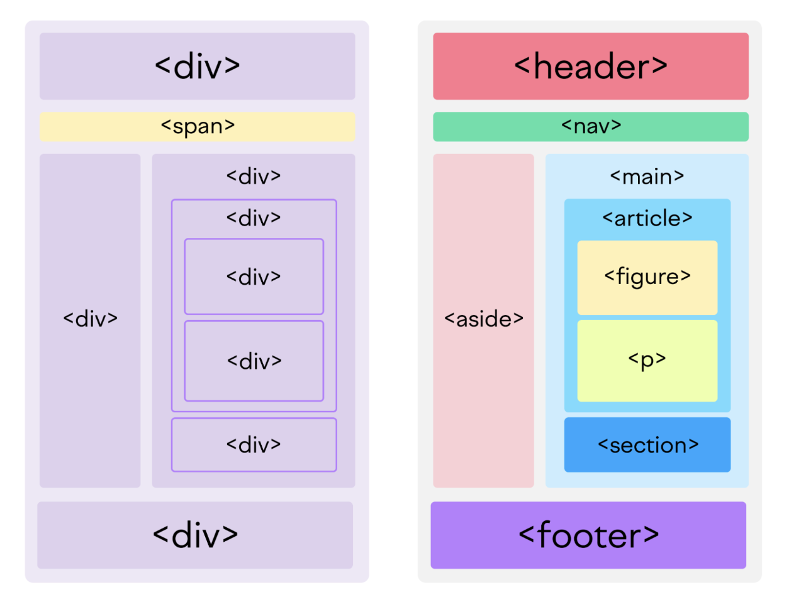

# HTML5的新特性

HTML5 是從 2014 年更新的，而 HTML4 是從 1999 年推出的，目前就這個趨勢很有可能在5年內會更新到 HTML 6。但是，請不用擔心現在學完 HTML5 之後會沒用，因為網絡上有很多正在運行的網頁都是 HTML4 的語法。新的版本通常只會對出新的功能或是更改一些規範，基本上你現在學到的新知識都是可以繼續沿用的。

# HTML 語義化

在學習新的特性前，我們需要了解舊的版本有什麼問題或是痛點。我們知道可以用 `<div>` 一般會當作一個容器包著其他元素，但是先看一下下面的例子，代碼中全部都是不同的 div 元素相互包著。你覺得不看 id 和 class 的話可以輕易理解代碼內容嗎？

```html
<div>
    <div class="header">
        ...
    </div>
    <span class="nav">...</span>
    <div class="side-bar">
        ...
    </div>
    <div class="main">
        <div class="article">
            <div class="figure">
                <p>...</p>
            </div>
        </div>
        <div class="section">
            ...
        </div>
    </div>
    <div class="footer">
        ...
    </div>
</div>
```

即使是經驗老道的大佬也不容易在沒有註解的情況下看懂這些代碼，所以在發現這些問題之後。在 HTML5 中就推出了有意義的容器元素，這些元素就像 div 一樣，用於包著其他元素方便控制佈局和樣式。但是在開發者和搜尋引擎的眼中就更加不同了。

```html
<div>
    <header>
        ...
    </header>
    <nav>...</nav>
    <aside>
        ...
    </aside>
    <main class="main">
        <article>
            <figure>
                <p>...</p>
            </figure>
        </article>
        <section>
            ...
        </section>
    </main>
    <footer>
        ...
    </footer>
</div>
```

不同語義的元素可以讓我們開發者快速了解網頁代碼的結構，每當維護和開發的時候就更節省時間了。另外可以幫助網站的搜尋排名提高，因為搜尋引擎可以更好的根據語義的元素找出網頁的主題和內容。

但是最重要的作用是提高網站的無障礙使用性，通過這些語義化元素，有障礙人士的裝置可以更好的識別網站的結構後再提醒用戶。



> 圖片來源於 [semrush.com](https://www.semrush.com/blog/semantic-html5-guide/)

