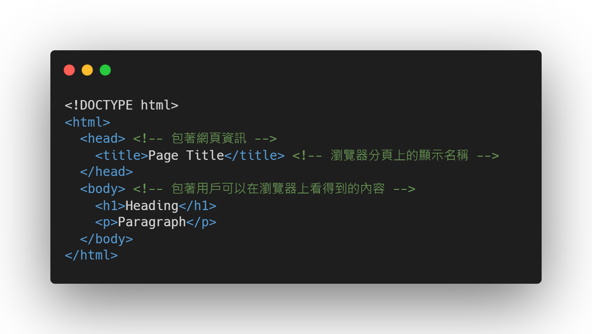

# HTML的基本結構和常用元素

就如我們開頭在實際網站案例中所看到的 HTML 代碼，HTML 代碼是由不同的標籤組成的，而大部分的標籤都是成對的。在這個章節，我們會學習一個 HTML 文檔必備的元素和常用的元素。

由於內容繁多，工作坊時間短暫，我們會把目光都放在最主要的元素裡，當然也會輕輕提及到其他常用但在這次工作坊中用不上的元素。讓我們開始走入網頁的世界吧！

## 必備的元素

每個 HTML 網頁都需要有包含以下圖片中的基本結構。在這個環節中的內容不需要死記硬背的，因為這些必備的元素基本上就是重複性的內容。所以智能的開發環境也不會放過這個可以幫助開發者的機會，我們可以通過前面提到的簡短熱鍵生成出來。

1. `<!DOCTYPE html>` 是用於告訴瀏覽器這個檔案是運行 HTML5 的，因為網絡中還有很多4.0或更舊的版本。當中有不同的關鍵字和功能，為了區分這些差別，需要我們特別提供版本。
2. `<html>` 元素是整個網頁的根元素，可以理解為盒中盒的最外圍的一個盒子，裝著全部的盒子。
3. `<head>` 元素包含了網頁中的資訊，例如網頁標題、描述、顏色主題等。
4. `<body>` 元素包含了網頁上所有能看見的內容。

> 想要補充一點資訊。我們說的必備元素是一種規範，是由大佬們定義出來的協議，即使我們在一個空白的 `.html` 中隨便打上幾個字母，瀏覽器也會很智能的幫我們補上這些必備的元素。