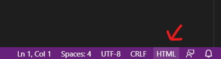
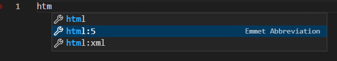
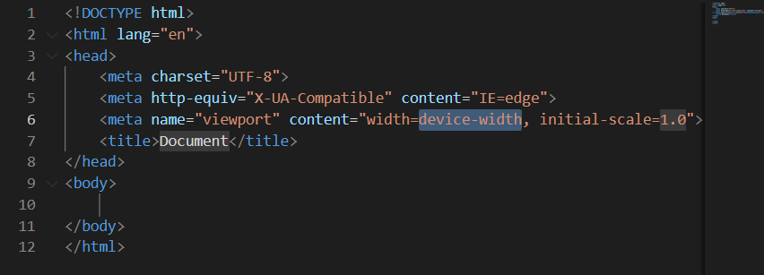

# 準備開發環境
開發環境（Integrated Development Environment - IDE）的意思是開發者編寫代碼的軟件，就如會計的工作需要用到 Excel 等的軟件。相比起電腦預設文字編輯器的乏味色調和只有文字編輯的功能，開發環境有著更加色彩艷麗的關鍵字提示，加上種類繁多且實用的插件，讓開發者擁有更高效的開發效率。

## Visual Studio Code (VS Code)
市面上有著不同受歡迎的開發環境，例如 [VS Code](https://code.visualstudio.com/)、[Webstorm](https://www.jetbrains.com/webstorm/)、[NetBeans](https://netbeans.apache.org/)等等。縱使有很多不同的選擇，我也通常只推薦 VS Code，因為安裝過程簡單、使用方式直觀、安裝額外插件也是非常簡單。

## 安裝 VS Code
首先可以去官網的[安裝頁面](https://code.visualstudio.com/download)，視乎你所使用的電腦的系統來下載相對應的版本。

下載後只需要按照安裝流程的指引就可以了。

## 安裝插件
對於某些編程語言，在 VS Code 上是需要安裝插件才能用快捷鍵生成代碼段的。前一段時間有這個很受歡迎的插件 [HTML Snippets](https://marketplace.visualstudio.com/items?itemName=abusaidm.html-snippets) 用於生成代碼塊，但是由於 VS Code 這幾年也開發了相對應的功能。也就是說這些功能是內置的，所以現在就不用安裝這個插件了。

> 如果想查看 VS Code 在 HTML 上有什麼內置功能的話可以[到此查看](https://code.visualstudio.com/docs/languages/html)。

另外一個插件是 [Live Server](https://marketplace.visualstudio.com/items?itemName=ritwickdey.LiveServer)。由於我們在修改代碼時，會想要直接看到網頁即使反饋修改後的效果，可是瀏覽器並沒有這樣的功能。所以就有了這個插件，它的主要功能是監視你的檔案有沒有修改，一旦有變動後就會刷新你的瀏覽器。這樣就可以提高我們開發的效率和直覺。

## 提升效率的技巧
對於所有重複性高的事情，我們一般會找方法去減低需要重複的動作，尤其是在電腦上的操作，可以省略就省略。所以才會有不同的插件去幫助開發者用最低的熱鍵生成重複的代碼，在這裡會展示上述提到的精神與使用方式的介紹。因為這樣的熱鍵有很多，我們會在後續的內容裡一一講解。

需要注意的是，鑒於 VS Code 基本上能夠支援市面上所有的編程語言，所以我們要留意在 IDE 的右下角中，目前的編輯的檔案是 HTML、CSS 或者 JavaScript（視乎目前的檔案類型），不然檔案格式不對應的話就熱鍵就不會生效了。詳情可以看下方圖片。

為了展示這些功能的強大，我們可以嘗試一下用熱鍵生成出一個最簡潔的 HTML 文件檔出來看看。首先創建一個新的 HTML 文件，然後確認右下方的檔案格式是 HTML。這個時候就可以在編輯框中使用熱鍵 `html:5` 來生成最簡約的 HTML 代碼塊，當我們輸入了熱鍵的頭幾個字母後就會看到有提示連著 `Emmet Abbreviation`，這個就是有生成代碼塊功能的意思。我們可以使用 `Tab` 或是 `Enter` 去確認執行目前選擇的熱鍵，也可以使用上、下方向鍵去改變不同的代碼塊來去生成。

以下是熱鍵會生成的代碼塊。請不用擔心，我們在後續部分會講解代碼的作用，這裡只是想要展示這些功能的強大之處。

